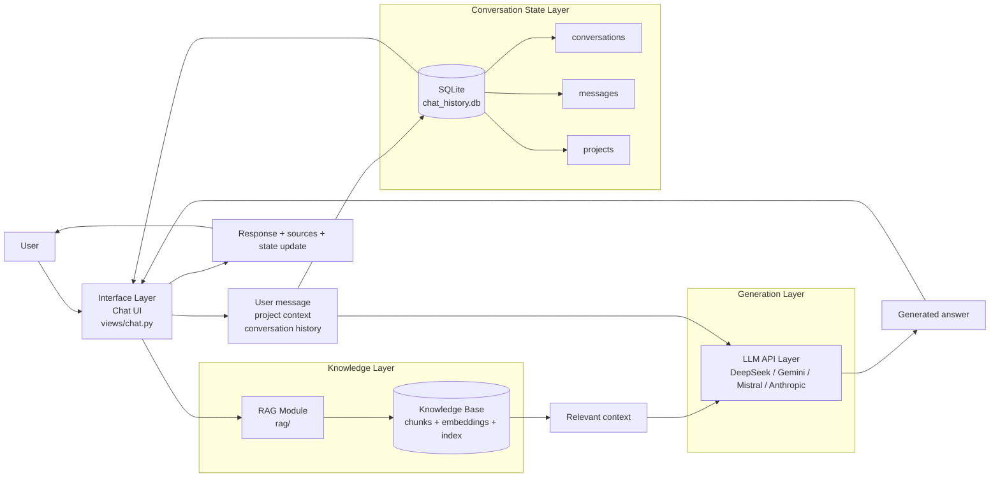

# layered system

### Interpretation
- Chat is the interface layer: it coordinates the interaction.
- SQLite is the conversation state: it stores messages, chats, and project metadata.
- RAG is the knowledge layer: it retrieves relevant information from indexed content.
- LLM API is the generation layer: it turns the combined prompt and retrieved context into the answer.
