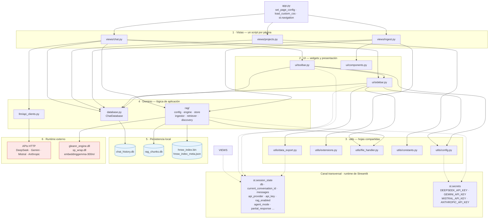

# A1 · Capas globales

| key | value |
|---|---|
| tipo | documento técnico · arquitectura · hoja A1 |
| tema | estructura estática · capas del sistema |
| titulo | Capas globales de theChat |
| maturity | implementado — refleja el código actual |
| confidence | alta (lectura directa del código) |
| material origen | código fuente completo de la app |
| fecha | 2026 |
| mantenedor | David |

## 1. Alcance

Esta hoja es el diagrama de portada. Muestra **en qué capas está organizado el sistema y qué cruza entre ellas**. No explica flujos (eso es la serie B) ni la estructura interna del RAG (hoja A7). Quien lea solo esta hoja debe entender de qué está hecho el sistema y dónde vive cada responsabilidad.

## 2. Diagrama

**Leyenda de trazos**
- Flecha sólida → import estático entre módulos.
- Flecha punteada → acceso a un global de runtime de Streamlit, no a un módulo.
- Cilindro → archivo en disco. Rectángulo rojo claro → fuera del proceso Python.

## 3. Las capas, una por una

**1 · Vistas.** Los tres archivos de `views/` no son módulos importables: son scripts que Streamlit ejecuta. `projects.py` e `ingest.py` corren código en el nivel superior del archivo; `chat.py` envuelve todo en `main()` y lo llama al final. Cada uno es dueño de su propia página y no conoce a los otros dos. La comunicación entre vistas ocurre **solo** por `st.session_state` y por la base de datos.

**2 · UI.** Widgets reutilizables. `sidebar.py` es más que presentación: es el *bootstrap* real del sistema — `init_database()` crea la base de datos, siembra las ~30 claves de `session_state`, lee secretos e instancia el retriever RAG. `toolbar.py` concentra la configuración de sesión (proveedor, esfuerzo, modo de agente, adjuntos, selector de proyecto, toggle RAG). `components.py` es CSS y el botón de copiar. Hay una dependencia **intra-capa**: `toolbar` importa `clear_current_conversation` de `sidebar`.

**3 · utils.** Hojas compartidas, sin dependencias hacia arriba. `file_handler.py` es la única implementación de extracción de texto y la consumen tanto el chat como el ingestor RAG — es la costura explícita entre las dos rutas. `extensions.py` es la única fuente de verdad de extensiones y exclusiones. `config.py` lee secretos, `constants.py` tiene la paleta de colores. Excepción: `data_export.py` no es una hoja pura — lee `session_state` directamente.

**4 · Dominio.** Tres módulos con perfiles muy distintos:
- `database.py` — acceso a `chat_history.db`, con migraciones idempotentes. Importa `streamlit` pero no lo usa (import muerto).
- `llm/api_clients.py` — cliente HTTP de los cuatro proveedores. Es el módulo **más limpio del sistema**: no importa nada interno, no toca `session_state`, es función pura de `(messages, api_key) → generador de texto`.
- `rag/` — el único subsistema que depende de código nativo. Importa `utils.file_handler` para extracción de texto.

**5 · Persistencia local.** Dos bases SQLite y dos archivos de índice HNSW. Son **ciclos de vida independientes**: `chat_history.db` la gestiona `database.py`, `rag_chunks.db` y el índice los gestiona `rag/store.py`. No hay transacción cruzada entre ellos y no comparten esquema de IDs.

**6 · Runtime externo.** Cuatro APIs HTTP (una por proveedor) y el runtime nativo (dos DLLs más los pesos de EmbeddingGemma). Es la única capa que sale del proceso Python y la que condiciona la portabilidad.

**Canal transversal.** `st.session_state` y `st.secrets` no son módulos: son globales del runtime. `session_state` lo leen y escriben las vistas, la UI, `data_export` y `rag` (para el retriever). `st.secrets` lo leen tres puntos distintos: `utils/config.py`, `rag/config.py` y `rag/ingestor.py`.

## 4. Reglas que este diagrama establece

1. **Ningún módulo de dominio importa de `views/` ni de `ui/`.** El flujo de dependencia es unidireccional hacia abajo. Se cumple.
2. **`rag/` es el único que toca el runtime nativo.** Todo lo demás es Python puro sobre HTTP o SQLite.
3. **`llm/api_clients.py` no tiene acoplamiento interno.** Cualquier propuesta de meterle contexto de proyecto debe respetar eso: el contexto se arma antes de llamarlo, no dentro.
4. **Hay dos caminos distintos hacia DeepSeek.** Uno en `llm/api_clients.py` (streaming del chat, con `reasoning_effort`) y otro en `rag/ingestor.py::call_deepseek` (troceo semántico, con reintentos, backoff y modo JSON). No comparten código.
5. **`rag/discovery.py` no participa del flujo de la app.** Existe y funciona, pero nadie lo importa desde una vista: la ingesta recibe bytes del uploader. Solo se usa por línea de comandos.
6. **`agent/` no aparece en el diagrama.** `agent/config.py` importa de `utils.extensions` pero ningún módulo lo importa a él. Es un huérfano.

## 5. Lo que esta hoja no muestra

- **El orden de ejecución dentro de una vista.** El diagrama dice que `chat.py` usa `sidebar`, `toolbar` y `database`; no dice en qué orden ni qué pasa entre medio. Eso es A3 y B2.
- **La estructura interna del RAG.** Acá es una caja; el zoom es A7, con los procesos en B12–B16.
- **El modelo de datos.** A5 y A6.
- **El grafo de imports exhaustivo**, módulo por módulo, con los ciclos y las violaciones menores. Es A2.
- **Los flujos entre capas en tiempo de ejecución.** Es la serie B completa.