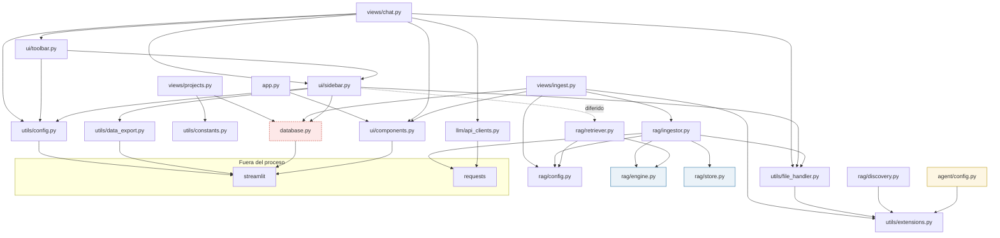

# A2 · Grafo de imports real

| key | value |
|---|---|
| tipo | documento técnico · arquitectura · hoja A2 |
| tema | estructura estática · dependencias entre módulos |
| titulo | Grafo de imports de theChat |
| maturity | implementado — derivado del código actual, línea por línea |
| confidence | alta (lectura directa de los imports) |
| material origen | código fuente completo de la app |
| fecha | 2026 |
| mantenedor | David |

## 1. Alcance

Esta hoja muestra **quién importa a quién**, con los imports tal como están escritos. A1 dibujaba las capas conceptuales; A2 dibuja las aristas reales. La diferencia entre ambos es donde aparece la deuda: dependencias que cruzan capas por atajos, imports que nunca se usan, y un import diferido que existe por una razón concreta.

No describe flujos de ejecución ni qué hace cada módulo. Solo la topología de dependencias.

## 2. Diagrama

**Leyenda**
- Flecha sólida → `import` / `from … import` estático, ejecutado al cargar el módulo.
- Flecha punteada → import **diferido** (dentro de una función, no en el encabezado).
- Borde rojo punteado → módulo con un import que viola el sentido de las capas.
- Borde amarillo → módulo huérfano (nadie lo importa).
- Borde azul → módulos sin una sola dependencia interna.

## 3. Topología

**El grafo es acíclico.** No hay ningún ciclo de imports estáticos. Es la propiedad más importante de la hoja y no es trivial: en una app que creció sin orden, es lo que permite razonar sobre el sistema por partes.

**Profundidad máxima: 3 aristas.** Las cadenas internas más largas son `views/chat.py → ui/toolbar.py → ui/sidebar.py → utils/data_export.py` y `views/chat.py → ui/sidebar.py ⇢ rag/retriever.py → rag/engine.py`. No hay cadenas más hondas, así que ningún módulo depende de más de tres saltos para resolver sus dependencias.

**Nodos hoja (sin dependencias internas):**
- `utils/extensions.py` — solo `frozenset`s literales.
- `utils/constants.py` — una lista literal.
- `llm/api_clients.py` — `json` + `requests`.
- `rag/engine.py` — `ctypes`, `json`, `os`, `numpy`.
- `rag/store.py` — `json`, `sqlite3`, `struct`, `hnswlib`, `numpy`.
- `rag/config.py` — `os`, `pathlib` (y un `streamlit` diferido).
- `ui/components.py` — `base64` + `streamlit`.
- `database.py` — `sqlite3` + `streamlit`.

**Fan-in (módulos más importados):**

| módulo | importadores |
|---|---|
| `utils/extensions.py` | 4 — `file_handler`, `views/ingest`, `rag/discovery`, `agent/config` |
| `utils/config.py` | 3 — `views/chat`, `ui/toolbar`, `ui/sidebar` |
| `utils/file_handler.py` | 3 — `views/chat`, `ui/sidebar`, `rag/ingestor` |
| `ui/components.py` | 3 — `app`, `views/chat`, `views/ingest` |
| `database.py` | 3 — `views/projects`, `views/ingest`, `ui/sidebar` |
| `rag/config.py` | 3 — `views/ingest`, `rag/ingestor`, `rag/retriever` |
| `ui/sidebar.py` | 2 — `views/chat`, `ui/toolbar` |
| `rag/engine.py` | 2 — `rag/ingestor`, `rag/retriever` |

`utils/extensions.py` es el nodo más importado del sistema y a la vez el más barato de cargar: cero dependencias, solo literales. La declaración de "única fuente de verdad" del docstring se sostiene en la topología.

**Fuera del proceso, `streamlit` es el import dominante.** Doce módulos lo importan directamente: `app.py`, las tres vistas, los tres de `ui/`, `utils/config.py`, `utils/data_export.py`, `database.py`, y de forma diferida `rag/config.py` y `rag/ingestor.py` (dentro de `_get_deepseek_key`). Es el verdadero framework del sistema, no solo la capa de presentación.

**`requests` aparece dos veces, en ramas distintas del grafo.** `llm/api_clients.py` y `rag/ingestor.py` son los dos únicos puntos de salida HTTP, y **no comparten código**. Ver §5.

## 4. Imports muertos

Imports que están en el encabezado y nunca se usan en el cuerpo del módulo. Ninguno rompe nada; todos ensucian la lectura.

| módulo | import | nota |
|---|---|---|
| `database.py` | `import streamlit as st` | **el único que además cruza capas** — ver §5 |
| `database.py` | `import json` | sin uso |
| `database.py` | `from datetime import datetime` | sin uso; todas las fechas son `CURRENT_TIMESTAMP` de SQL |
| `views/chat.py` | `from utils.config import get_secret` | sin uso en el archivo |
| `views/chat.py` | `from typing import Any, Literal` | sin uso |
| `views/ingest.py` | `from ui.components import load_custom_css` | marcado `# noqa` con un comentario explícito de que el CSS ya se cargó en `app.py` |
| `rag/ingestor.py` | `import io` | sin uso |
| `rag/ingestor.py` | `import re` | sin uso |

`database.py` acumula tres de los ocho. Es el módulo con más residuo de imports.

## 5. Rarezas y violaciones de capa

**5.1 · `database.py` importa `streamlit` sin usarlo.**
Es la única violación real de dirección en el sistema. Según la regla declarada en A1, los módulos de dominio no deberían depender del framework de UI. Acá no hay dependencia funcional —el import no se usa— pero sí acopla la carga del módulo al entorno de Streamlit: `database.py` no se puede importar desde un script pelado sin que Streamlit esté instalado. El fix es borrar la línea, no refactorizar nada.

**5.2 · `ui/sidebar.py` importa `rag.retriever` de forma diferida.**
Es el único import diferido del sistema y está dentro de `init_database()`, envuelto en un `try/except` que degrada a `rag_available = False`. No es una violación de dirección (ui → rag va hacia abajo), pero sí un problema de **ubicación**: el arranque de un subsistema de dominio —cargar el motor nativo, el índice HNSW— vive dentro de la UI. Es la razón por la que el retriever se instancia en cada sesión aunque el toggle esté apagado.

El import diferido tiene una justificación concreta y buena: si el motor RAG no está disponible (faltan DLLs, falta el modelo), la app de chat sigue arrancando. Un import en el encabezado tumbaría todo el módulo.

**5.3 · `views/chat.py` no importa `rag` en absoluto.**
El chat accede al retriever a través de `st.session_state.rag_retriever`, no por import. La capa de vista queda desacoplada del subsistema RAG, pero ese desacople se logra con un global de runtime, no con una interfaz. Es un intercambio: menos acoplamiento estático, más acoplamiento implícito.

**5.4 · `ui/toolbar.py → ui/sidebar.py` es la única dependencia intra-capa.**
`toolbar` importa `clear_current_conversation` de `sidebar` y provoca que `sidebar` —que es el bootstrap del sistema— sea dependencia de casi toda la UI. El resultado es que `sidebar.py` no es solo presentación: es el inicializador de facto.

**5.5 · Dos clientes HTTP a DeepSeek, en ramas separadas del grafo.**
`llm/api_clients.py` y `rag/ingestor.py` tienen cada uno su propia función (`stream_deepseek_completion` y `call_deepseek`), sus propios timeouts y su propio manejo de errores. Ninguno importa del otro. Es la duplicación estructural más grande visible en este diagrama: dos caminos que no se conocen.

**5.6 · `utils/data_export.py` no es una hoja pura.**
Importa `streamlit` y opera sobre `st.session_state` — lee `db`, `messages`, `current_conversation_id`, `reformulation_count`, `tokens_wasted`. Todo lo demás en `utils/` es sin estado; este no. La consecuencia es que su API no se puede llamar fuera de una sesión de Streamlit.

**5.7 · `agent/config.py` es huérfano.**
Importa `utils.extensions` correctamente, pero **ningún módulo del sistema lo importa**. Está en el grafo solo como receptor de una arista entrante desde `utils/extensions`. Marca el único punto del código donde existe un paquete que no participa de ningún flujo.

**5.8 · `rag/discovery.py` importa `utils.extensions` tras un `sys.path` manual.**
Inserta `PROJECT_ROOT` en `sys.path` antes de importar. Lo mismo hace `rag/retriever.py`. Bajo el arranque normal de Streamlit es redundante —la raíz ya está en el path— y solo tiene sentido cuando esos archivos se ejecutan como script por línea de comandos. Es la huella de que `rag/` se desarrolló primero como herramienta CLI y después se integró a la app.

## 6. Lo que esta hoja no muestra

- **El orden de carga en tiempo de ejecución.** El grafo dice que `ui/sidebar.py` importa `rag/retriever.py`; no dice cuándo ni cuántas veces. Es A3 y B2.
- **El uso real de cada import.** Una arista existe aunque el símbolo importado nunca se use — eso se detalla solo para los casos muertos de §4.
- **Las dependencias con `st.session_state`,** que son el canal de acoplamiento más fuerte del sistema y no pasan por imports. Es A3.
- **Las dependencias con el runtime nativo** (DLLs, modelo). `rag/engine.py` las carga en tiempo de ejecución vía `ctypes`, no vía import. Es A9.
- **La estructura interna del paquete `rag/`** más allá de las aristas entre sus cinco módulos. Es A