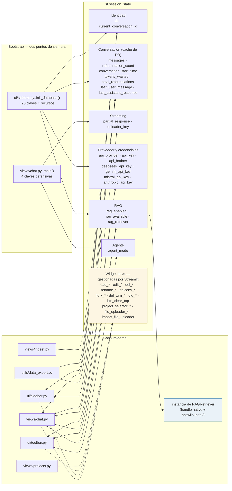

# A3 · Capa de estado

| key | value |
|---|---|
| tipo | documento técnico · arquitectura · hoja A3 |
| tema | estructura estática · estado de sesión |
| titulo | La capa de estado de theChat |
| maturity | implementado — derivado del código actual, clave por clave |
| confidence | alta (lectura directa del código) |
| material origen | código fuente completo de la app |
| fecha | 2026 |
| mantenedor | David |

## 1. Alcance

Esta hoja documenta el canal de acoplamiento más fuerte del sistema. Las vistas no se importan entre sí, no hay callbacks compartidos, y no hay un objeto orquestador: **toda la coordinación entre páginas pasa por `st.session_state` y por `st.rerun()`**. Quien lea solo esta hoja debe entender qué estado vive en la sesión, quién lo escribe, quién lo lee, cuándo se crea y cuándo se pierde.

No describe flujos (eso es la serie B) ni el modelo de datos persistido (A5, A6). Acá se habla del estado *en memoria* de Streamlit.

## 2. Diagrama

**Leyenda**
- Flecha bidireccional → el módulo lee y escribe la categoría.
- Flecha simple → solo un sentido (siembra al arrancar, o lectura derivada).
- Borde amarillo → claves efímeras que Streamlit crea y destruye solo.
- Borde azul → la única clave que sostiene un recurso nativo no serializable.

## 3. Las claves, una por una

### 3.1 · Identidad

| clave | escribe | lee | persiste | nota |
|---|---|---|---|---|
| `db` | `init_database()` | todo | archivo | instancia de `ChatDatabase`; abre conexiones efímeras |
| `current_conversation_id` | `init_database`, `create_new_conversation`, `switch_conversation`, `create_fork`+`switch` | todo | sí, es un id de fila | el "puntero" a la conversación activa |

### 3.2 · Conversación en memoria

| clave | escribe | lee | persiste | nota |
|---|---|---|---|---|
| `messages` | `init_database`, `create_new_conversation`, `switch_conversation`, `clear_current_conversation`, `chat.py` (append por turno) | `chat.py`, `toolbar`, `data_export` | **sí, en `messages`** | caché write-through de la DB |
| `reformulation_count` | `init_database`, `chat.py`, varios resets | `chat.py`, `data_export` | como texto del mensaje | contador por **conversación** |
| `total_reformulations` | `init_database`, `chat.py` | `toolbar`, `data_export` | no | contador por **sesión** |
| `conversation_start_time` | `init_database`, `create/switch/clear` | solo `render_sidebar` | no | caption "Sesión iniciada" |
| `tokens_wasted` | `init_database`, `chat.py` | `data_export` | no | heurística `len//4`, solo para el export |
| `last_user_message` | `init_database` (reset), `chat.py` | **nadie** | no | **clave muerta** — ver §5 |
| `last_assistant_response` | `init_database` (reset), `chat.py` | **nadie** | no | **clave muerta** — ver §5 |

### 3.3 · Streaming y ciclo del uploader

| clave | escribe | lee | nota |
|---|---|---|---|
| `partial_response` | `chat.py` en cada chunk del stream; reset al guardar | `chat.py` | si el usuario recarga, el parcial se guarda como mensaje `truncated=True` **en el turno siguiente** |
| `uploader_key` | `chat.py::main()` (init), `chat.py` (+1 por turno) | `toolbar` | se usa como sufijo de la `key` del `file_uploader` para forzar un widget nuevo — reseteo del uploader sin API oficial |

### 3.4 · Proveedor y credenciales

| clave | escribe | lee | nota |
|---|---|---|---|
| `api_provider` | `init_database` (default `"DeepSeek"`), `toolbar` | `chat.py`, `toolbar` | |
| `api_key` | `init_database`, `toolbar` | `chat.py` | **redundante** con `{provider}_api_key` — ver §5 |
| `api_brainer` | `chat.py::main()` (init), `toolbar` | `chat.py`, `toolbar` | nivel de esfuerzo |
| `deepseek_api_key` | `init_database`, `toolbar` | `toolbar` | se reescribe desde `secrets` en cada rerun de `configure_api_key()` |
| `gemini_api_key` | ídem | ídem | ídem |
| `mistral_api_key` | ídem | ídem | ídem |
| `anthropic_api_key` | ídem | ídem | ídem |

### 3.5 · RAG

| clave | escribe | lee | nota |
|---|---|---|---|
| `rag_enabled` | `init_database` (False), `toolbar` (checkbox con `key="rag_enabled"`) | `chat.py` | la única clave que también es **key de widget** |
| `rag_available` | `init_database` | `chat.py`, `toolbar` | flag derivado: hay retriever o no |
| `rag_retriever` | `init_database` | `chat.py` | **instancia viva con recursos nativos** — ver §5 |

### 3.6 · Agente

| clave | escribe | lee | nota |
|---|---|---|---|
| `agent_mode` | `chat.py::main()` (default `"chat"`), `toolbar` (radio) | `toolbar` | escribe en una capa, edita en otra — y no dispara nada más |

### 3.7 · Widget keys

Streamlit crea y gestiona estas claves automáticamente cuando el código pasa `key=` a un widget. No son estado de aplicación, pero sí ocupan el mismo namespace y son las responsables de la mayor parte del ruido si uno hace `print(st.session_state)`.

Inventario completo según el código:

| patrón | origen |
|---|---|
| `file_uploader_{uploader_key}` | `toolbar` |
| `btn_clear_top` | `toolbar` |
| `project_selector_{conv_id}` | `toolbar::_render_project_selector` |
| `load_{conv_id}`, `edit_{conv_id}`, `del_{conv_id}` | `sidebar::_render_conversation_row` |
| `rename_input_{id}` / `rename_ok_{id}` / `rename_cancel_{id}` | modal de renombrar |
| `delconv_ok_{id}` / `delconv_cancel_{id}` | modal de borrar |
| `fork_{msg_id}` / `del_turn_{msg_id}` | `chat.py` |
| `dlg_create_ok` / `dlg_create_cancel` | `projects` |
| `dlg_edit_ok` / `dlg_edit_cancel` | `projects` |
| `dlg_del_ok` / `dlg_del_cancel` | `projects` |
| `dlg_clear_yes` / `dlg_clear_no` | `toolbar` |
| `import_file_uploader` | `sidebar` |

## 4. Ciclo de vida del estado

**Cuándo se siembra.** Dos puntos de siembra, con orden obligatorio:

1. `views/chat.py::main()` siembra cuatro claves **antes** de llamar al bootstrap: `agent_mode`, `api_brainer`, `uploader_key`, `messages`. Las cuatro usan el patrón `if X not in st.session_state`.
2. `ui/sidebar.py::init_database()` siembra el resto: identidad (`db`, `current_conversation_id`), credenciales, conversación en memoria, RAG. También hace tres cosas que no son siembra de claves: crea el `ChatDatabase` (que corre migraciones), ejecuta `delete_empty_conversations()` y **construye el `RAGRetriever`**. Ese último paso es el único que puede tardar segundos.

El orden entre los dos puntos es una dependencia real y no declarada: `chat.py` siembra `messages` como lista vacía, pero `init_database` lo **sobrescribe** con lo que lee de la base de datos si la clave ya existe? No: solo lo siembra si falta. La consecuencia es que la siembra de `chat.py` para `messages` es un no-op la mayoría de las veces, y solo protege contra un caso que no puede ocurrir porque `init_database` viene después.

**Cuándo se pierde.** Hay tres niveles de vida, con nombres que Streamlit no expone de forma obvia:

| nivel | cuándo se destruye | qué claves están en este nivel |
|---|---|---|
| Reejecución (rerun) | cada interacción de widget | **ninguna clave de `session_state`** — es exactamente su propósito |
| Sesión | al cerrar la pestaña o el servidor | todas las claves de §3 |
| Archivo | nunca, hasta que se borre el `.db` | lo que está en `chat_history.db` y `rag_chunks.db` |

La distinción es la que explica el comportamiento del parcial: `partial_response` vive a nivel de sesión, así que **sobrevive a un `rerun` pero no a una recarga de página**. Si el usuario recarga a mitad de stream, la sesión se destruye y el parcial desaparece con ella — no se guarda como truncado. El guardado como `truncated=True` ocurre solo si el parcial sobrevive, es decir, si hubo un `rerun` anómalo sin recarga (por ejemplo, una interacción de widget durante el stream). El doc `uiux.md §3.4` afirma que "nothing is silently lost"; la afirmación es cierta para el caso de `rerun` y **falsa para el caso de recarga**. Vale tenerlo anotado.

**Qué se resetea en cada acción.** Los cuatro verbos grandes del ciclo de conversación tocan un conjunto distinto de claves:

| acción | resetea | conserva |
|---|---|---|
| `create_new_conversation()` | `messages`, `reformulation_count`, `last_user_message`, `last_assistant_response`, `conversation_start_time`, `partial_response` | `tokens_wasted`, `total_reformulations`, `uploader_key` |
| `switch_conversation()` | los mismos seis | los mismos tres |
| `clear_current_conversation()` | los mismos seis | los mismos tres — **y borra los mensajes de la DB**, los otros dos no |
| guardar una respuesta exitosa | `partial_response`, `reformulation_count` | todo lo demás |

Los tres verbos de cambio de conversación resetean **el mismo conjunto**, y ninguno resetea `tokens_wasted` ni `total_reformulations`. Eso es coherente con la definición de esas dos claves como contadores de **sesión**, no de conversación — pero el header del toolbar muestra `total_reformulations` junto a `Mensajes` y `Conversación #id`, que sí son de conversación. La lectura visual mezcla dos alcances distintos.

**El patrón "reset en cascada" es manual.** No hay una función `reset_conversation_state()` que centralice los seis resets; están repetidos literalmente en tres funciones distintas de `sidebar.py`. Agregar una séptima clave de conversación obliga a tocar los tres lugares, y nada avisa si uno se olvida.

## 5. Rarezas y problemas

**5.1 · Dos claves muertas declaradas y mantenidas.**
`last_user_message` y `last_assistant_response` se siembran en `init_database()`, se resetean en las cuatro funciones de ciclo de conversación, y en `chat.py` se escriben **en cada turno**. Ningún módulo las lee. El export no las incluye (`data_export` exporta `reformulation_count`, `tokens_wasted` y `total_reformulations`, no estas dos). Son un vestigio de un diseño previo donde el contexto se armaba a mano con el último par de mensajes; hoy el contexto se arma con `st.session_state.messages` completo. Se pueden borrar las ~8 líneas sin tocar nada más.

**5.2 · `api_key` duplica a `{provider}_api_key`.**
Cada vez que el usuario cambia de proveedor, `configure_api_key()` lee el secreto correspondiente, lo escribe en `st.session_state.{provider}_api_key` **y también** en `st.session_state.api_key`. `chat.py` consume solo `api_key`. Las claves por proveedor, entonces, son el almacenamiento y `api_key` es un alias del "activo". Es un patrón de puntero válido, pero no hay nada que garantice la sincronía: si alguien modificara `api_key` sin pasar por `configure_api_key()`, el par `{provider}_api_key` quedaría desactualizado y el próximo cambio de proveedor lo sobrescribiría de vuelta. Funciona porque el único escritor es `configure_api_key()`, pero es una regla tácita.

Además, `configure_api_key()` **reescribe los cuatro secretos en cada rerun** desde `get_secret()`. Eso tiene dos consecuencias: cualquier valor que un humano hubiera puesto a mano en `session_state` se pierde en el siguiente rerun, y como la función se ejecuta en cada arranque del toolbar, los secretos se leen del `secrets.toml` constantemente. Con secretos estáticos es inocuo; si alguna vez se quiere permitir editar la key desde la UI, esto lo bloquea.

**5.3 · `rag_retriever` sostiene recursos nativos dentro de `session_state`.**
Es la única clave que guarda un objeto no serializable con handles abiertos: una instancia de `RAGRetriever` que a su vez contiene un `GleannEngine` (con sus dos DLLs cargadas y el modelo en memoria) y un `hnswlib.Index`. Tres consecuencias:

- **`session_state` no es el lugar natural para esto.** Toda la vida útil está atada al ciclo de sesión, sin `close()` explícito. Depende de que `__del__` del engine haga la limpieza cuando la sesión muere.
- **Se construye eager, en `init_database()`.** Cargar el motor tarda; el usuario paga ese costo en cada arranque, aunque `rag_enabled` esté en `False` y no vaya a usar RAG en toda la sesión.
- **Un fallo de import degrada silenciosamente.** El `try/except` que envuelve la construcción deja `rag_available = False` y sigue; el mensaje de error va a `print()`, o sea a la consola del servidor, no a la UI. El usuario que tiene las DLLs rotas no ve un aviso: ve el checkbox RAG ausente, sin explicación.

**5.4 · `rag_enabled` es la única clave que es también widget key.**
El checkbox del toolbar se declara con `key="rag_enabled"`, así que Streamlit escribe la clave en cada rerun. `chat.py` la lee. Funciona, pero acopla el nombre interno del estado al `key` del widget: renombrar el checkbox rompe la lectura. Es el único caso del sistema donde estado de aplicación y estado de widget son literalmente lo mismo; el resto usa el patrón `value=default, key=...` o lee el retorno del widget.

**5.5 · `agent_mode` se siembra en una capa y se edita en otra.**
`chat.py::main()` la siembra; `toolbar.py` la muestra y la modifica; `chat.py` no la vuelve a mirar. **Nadie más la consume**, así que hoy es una clave que se escribe y se lee para producir un mensaje de estado. Refuerza lo que ya decía B18: el modo agente es un path muerto, y esta hoja lo confirma a nivel de estado.

**5.6 · `messages` es una caché write-through sin invariante.**
La lista en `session_state.messages` duplica el contenido de la tabla `messages`. La regla de mantenimiento es tácita: `save_message()` escribe a la DB, y acto seguido el código appendea el mismo diccionario a `session_state.messages` **con el `id` devuelto** (esa es la razón del `st.session_state.messages[-1]["id"] = ...` en `chat.py`). Los dos caminos van en paralelo, no en secuencia validada. Un fallo silencioso en `save_message()` desincroniza ambos lados sin avisar, y `load_conversation_messages()` —el único refresco desde la DB— solo se invoca al cambiar de conversación o tras borrar un turno.

El caso más visible está en el `except` de `chat.py`: cuando el streaming lanza una excepción, el mensaje de error se appendea a `session_state.messages` **sin llamar a `save_message()`**. La lista en memoria tiene un mensaje más que la DB, y ese mensaje no lleva `id`. Si el usuario recarga, el mensaje de error desaparece del historial; si sigue interactuando, el fork y el borrado de turno pueden operar sobre un `msg["id"]` que no corresponde. Es una desincronización real, no teórica.

**5.7 · El namespace es plano.**
Estado de aplicación (§3.1–§3.6) y widget keys (§3.7) comparten el mismo diccionario sin prefijo ni separación. La lista de keys de widgets se genera por interpolación de ids — `load_{conv_id}`, `project_selector_{conv_id}`, `fork_{msg_id}` — así que el diccionario **crece con el uso**: cada conversación visitada y cada mensaje sobre el que se hizo hover de un botón deja sus keys en sesión. No es un leak de memoria relevante (son enteros y strings), pero sí es la razón por la que `st.session_state` deja de ser inspeccionable a los pocos minutos de uso, y por la que no se puede usar `st.session_state.keys()` como fuente de verdad de nada.

**5.8 · La siembra de `uploader_key` está duplicada.**
`chat.py::main()` la siembra **y** `init_database()` también lo hace. Es la cuarta clave que aparece en los dos puntos de siembra, junto con `api_brainer` —el mismo patrón. Inofensivo, pero delata que el reparto de responsabilidades entre los dos puntos de siembra no fue diseñado, se fue agregando.

## 6. Lo que esta hoja no muestra

- **El esquema y el contenido de `chat_history.db`.** Acá solo se habla del estado en memoria; la forma de la DB es A5.
- **Los flujos que mueven cada clave.** Esta hoja dice que `messages` se escribe en el turno de chat; el diagrama que detalla el turno paso a paso es B3, y el de interrupción y truncamiento es B7.
- **El orden de render dentro de una vista.** El hecho de que el toolbar se dibuje *después* del historial, o que `render_sidebar()` se llame *antes* de leer el proyecto activo, no está acá: es B2.
- **La construcción del `RAGRetriever`.** Que se instancia eager se dice en §5.3; cómo se inicializa el motor nativo, paso por paso, es B13.
- **Las claves que agrega Streamlit por su cuenta** más allá de las que el código genera con `key=`. Hay meta-claves propias del framework que no aparecen en este inventario porque el código nunca las toca.