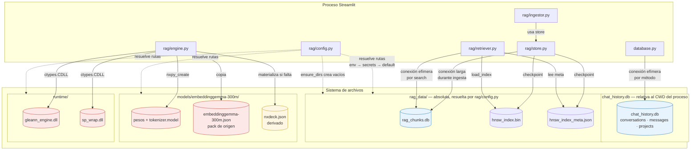
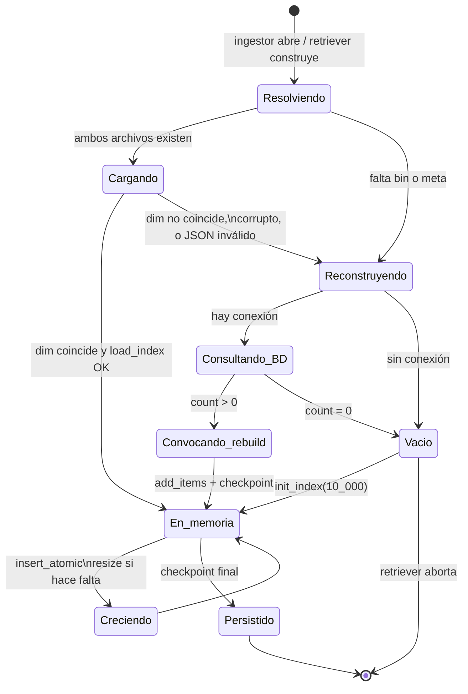

# A4 · Capa de persistencia física

| key | value |
|---|---|
| tipo | documento técnico · arquitectura · hoja A4 |
| tema | estructura estática · artefactos en disco |
| titulo | La capa de persistencia de theChat |
| maturity | implementado — derivado del código actual, archivo por archivo |
| confidence | alta (lectura directa del código) |
| material origen | código fuente completo de la app |
| fecha | 2026 |
| mantenedor | David |

## 1. Alcance

Esta hoja documenta **qué artefactos toca el sistema en disco, quién los posee y con qué ciclo de vida**. A1 mostraba la persistencia como dos cajas; acá se abren, se agregan los artefactos que A1 no dibujaba (el índice HNSW son dos archivos, el modelo genera un tercero en el primer arranque) y se documenta la asimetría más grande del subsistema: los dos SQLite no comparten dueño, no comparten convención de ruta y no comparten modelo de conexión.

No describe el esquema de columnas (A5, A6) ni los flujos que escriben estos archivos (B12–B16). Acá se habla de *dónde vive cada byte*.

## 2. Diagrama



**Leyenda**
- Cilindro azul → artefacto **de datos**, propiedad de la app.
- Cilindro amarillo → artefacto **derivado**: no se versiona, se regenera.
- Cilindro rojo claro → artefacto **binario de terceros**: se distribuye, no se genera.
- Flecha punteada → resolución de ruta en tiempo de import de `rag/config.py`.

## 3. Los artefactos, uno por uno

### 3.1 · `chat_history.db`

| propiedad | valor |
|---|---|
| ruta | literal `"chat_history.db"` |
| resolución | **relativa al directorio de trabajo del proceso**, no al archivo raíz |
| dueño | `database.py::ChatDatabase` |
| contenido | 3 tablas, 6 índices (ver A5) |
| journal mode | default de SQLite (`DELETE`) — no se configura |
| FK enforcement | declaradas en el DDL, **nunca activadas** |
| quién lo abre | tres puntos, todos con el mismo literal |

Los tres puntos de apertura inicial:

- `ui/sidebar.py::init_database()` — el camino normal.
- `views/projects.py` — init defensivo, por si se entra directo a la página.
- `views/ingest.py` — mismo init defensivo.

Los tres son idénticos (`if "db" not in st.session_state: ChatDatabase("chat_history.db")`) y ninguno calcula la ruta a partir de `BASE_DIR`. Si se lanza Streamlit desde otro directorio, **se crea una base distinta** y el usuario ve el historial vacío sin ningún error. Ver §7.1.

### 3.2 · `rag_chunks.db`

| propiedad | valor |
|---|---|
| ruta | `RAG_DB_PATH`, default `rag_data/rag_chunks.db` |
| resolución | `env → st.secrets → default`; el default parte de `BASE_DIR` |
| dueño | `rag/store.py` (esquema) + `rag/ingestor.py` (escritura) |
| contenido | 1 tabla, 6 índices (ver A6) |
| journal mode | default — no se configura |
| quién lo abre | ingestor (larga) y retriever (efímera) |

A diferencia de `chat_history.db`, esta ruta es **absoluta y estable**: `BASE_DIR = Path(__file__).resolve().parent.parent` en `rag/config.py` ancla el default al directorio del paquete `rag/`, no al CWD del proceso. Es la convención correcta y la que no tiene el otro SQLite.

### 3.3 · `hnsw_index.bin` + `hnsw_index_meta.json`

Son **dos archivos que representan un solo objeto lógico**, y eso define su ciclo de vida.

| propiedad | valor |
|---|---|
| rutas | `RAG_INDEX_PATH` y `RAG_INDEX_META_PATH` |
| escritor único | `rag/store.py::checkpoint()` |
| lectores | `rag/retriever.py` (al construir) y `rag/ingestor.py::_load_or_create_index` |
| orden de escritura | bin primero, meta después |

El `checkpoint()` escribe el índice y luego el JSON, con un comentario en el código que explicita la razón: reducir el riesgo de una escritura a medias en la que el meta anuncie algo que el bin no contiene.

La consecuencia práctica es que **un checkpoint interrumpido degrada a reconstrucción, no a corrupción**. Los dos lectores exigen que *ambos* archivos existan para intentar cargar:

- `retriever.__init__` levanta `FileNotFoundError` si falta cualquiera de los dos.
- `_load_or_create_index` cae a la rama de reconstrucción desde la BD si falta cualquiera.

Es decir: el bin es **recuperable desde `rag_chunks.db`** porque los embeddings quedaron guardados ahí. Esa redundancia —la BD conserva el vector, el índice lo duplica— es lo que hace que perder el índice no sea catastrófico. Ver §6.

**Contenido del meta.** `checkpoint()` escribe seis campos; los lectores usan dos.

| campo | escritor | lector | nota |
|---|---|---|---|
| `dim` | ✅ | ✅ `retriever`, `ingestor` | validado contra `engine.target_dim` |
| `ef` | ✅ | ✅ ambos, con default 50 | |
| `num_elements` | ✅ | ❌ | write-only |
| `space` | ✅ | ❌ | `"cosine"` fijo; write-only |
| `index_path` | ✅ | ❌ | ruta **absoluta** al momento de escribir |
| `db_path` | ✅ | ❌ | ruta **absoluta** al momento de escribir |

Los tres últimos son metadatos inertes. Los dos últimos, además, quedan obsoletos si el proyecto se mueve de directorio, porque congelan la ruta absoluta de la máquina en que se generaron.

### 3.4 · Assets del modelo

| artefacto | origen | cuándo aparece |
|---|---|---|
| `models/embeddinggemma-300m/` (pesos) | descarga del usuario | antes del primer arranque |
| `models/embeddinggemma-300m/tokenizer.model` | idem | idem |
| `models/embeddinggemma-300m.json` (pack) | idem | idem |
| `models/embeddinggemma-300m/nxdeck.json` | **generado por `rag/engine.py`** | en el primer `nxpy_create` exitoso |

Los tres primeros son binarios distribuidos; el cuarto es un artefacto de runtime que vive **dentro del directorio del modelo**. `engine.py` lo materializa copiando el contenido del pack JSON si no existe, en el `__init__` de `GleannEngine`. Es la única escritura del sistema que ocurre *antes* de cualquier acción del usuario: construir el motor por primera vez escribe un archivo.

La mezcla es incómoda: el directorio del modelo tiene tres archivos inmutables y uno generado, en el mismo nivel, sin ningún marcador que los distinga. Quien reponga el modelo desde una descarga limpia pierde el `nxdeck.json` y lo recupera solo en el próximo arranque.

### 3.5 · DLLs

`runtime/gleann_engine.dll` y `runtime/sp_wrap.dll`. El proceso las carga con `ctypes.CDLL(..., winmode=0)` — el flag está documentado en el código como necesario porque Python 3.8+ cambió la búsqueda de dependencias en Windows. No hay ruta de fallback a otra ubicación: si están en otro directorio, `rag/config.py` las tiene que apuntar por variable de entorno.

Es el único punto del sistema donde un archivo es **código ejecutable cargado en el proceso**, no datos. `ctypes.CDLL` es también la única frontera del sistema que puede tumbar la app con un `OSError` de bajo nivel en lugar de una excepción de Python.

### 3.6 · `ensure_dirs()` y los directorios fantasma

`rag/config.py::ensure_dirs()` crea con `mkdir(parents=True, exist_ok=True)` los cuatro directorios: `rag_data/`, el del modelo, el de las DLLs y el del pack. Lo llaman `ingestor.ingest_documents` y `retriever.__init__` al arrancar.

La consecuencia es que **la app puede tener el árbol de directorios completo y ninguno de sus archivos**. Es exactamente el estado en que queda una instalación nueva que abrió el chat sin descargar el modelo: `rag_data/` existe y está vacío, `models/embeddinggemma-300m/` existe y está vacío, `runtime/` existe y está vacío.

Eso es lo que explica el diseño de `views/ingest.py::check_rag_prerequisites()`: no alcanza con verificar que los directorios existan, hay que verificar cada archivo individualmente. Y también explica por qué distingue entre rutas **críticas** (modelo, tokenizer, DLLs, pack — sin esto no se puede embedir) y **regenerables** (los dos archivos del índice HNSW — se reconstruyen solos).

## 4. Los dos modelos de conexión

El sistema usa SQLite de dos maneras distintas, y la diferencia refleja los dos patrones de acceso.

**`chat_history.db` — efímera siempre.** Los ~25 métodos de `ChatDatabase` abren y cierran la conexión dentro del método, con `with sqlite3.connect(...) as conn`. Cada interacción de UI produce entre dos y cinco conexiones. Ninguna se reutiliza. El patrón es trivialmente correcto en cuanto a fugas, pero paga el costo de setup en cada operación y no permite agrupar escrituras.

**`rag_chunks.db` — larga durante la ingesta, efímera en la consulta.** La ingesta abre **una** conexión al principio de `ingest_documents`, la mantiene durante todo el procesamiento del lote y la cierra en el `finally`. Cada `insert_atomic` adentro hace su propio `BEGIN`/`COMMIT`, así que hay una transacción por chunk sobre una sola conexión. En retrieval, `search()` y `list_projects()` abren y cierran una conexión por llamada.

La asimetría tiene sentido: la ingesta es un proceso largo con estado compartido (la misma conexión, el mismo índice en memoria), y la consulta es una operación puntual. El costo de la asimetría es que no hay un objeto "repositorio" común para RAG; cada entry point maneja su propia conexión.

**Lo que ninguno de los dos configura:**

- **`PRAGMA journal_mode`** — ambos quedan en el default `DELETE`. Cada escritura toma un lock exclusivo sobre el archivo; con dos conexiones simultáneas (no es el caso hoy, todo es single-threaded en Streamlit) o con la ingesta corriendo en paralelo a un chat, uno de los dos recibe `database is locked`. WAL lo evitaría sin costo. No se activa en ningún lado.
- **`PRAGMA foreign_keys = ON`** — el DDL declara `FOREIGN KEY (conversation_id) REFERENCES conversations(id)` en `messages`, pero SQLite arranca con enforcement **desactivado** por compatibilidad, y el pragma es *por conexión*. Como las conexiones son efímeras, habría que ejecutarlo en cada apertura. Nadie lo hace. Los FKs son decorativos.
- **`PRAGMA busy_timeout`** — sin timeout configurado, el default es 0 y un lock ajeno falla al instante en lugar de esperar.
- **`PRAGMA synchronous`** — default `FULL`, que es lo correcto para durabilidad y lo que no se toca. Es la única de las cuatro decisiones que no llama la atención.
- **`VACUUM` / `auto_vacuum`** — ninguno. `chat_history.db` no recupera el espacio de las conversaciones soft-deleted (que siguen ocupando fila), ni de los mensajes borrados por `delete_messages` / `delete_last_turn`.

Ninguno de los dos SQLite lleva **versión de esquema** ni tabla de migraciones. La idempotencia se logra introspeccionando `PRAGMA table_info` en cada arranque (`database.py::_migrate`, `rg/store.py::migrate_rag_chunks`). Funciona, pero no hay registro de qué migraciones se aplicaron: la única fuente de verdad es el estado actual del esquema.

## 5. La redundancia de embeddings

`rag_chunks.db` guarda **una copia de cada embedding** y el índice HNSW guarda **otra**. Es la decisión de diseño más importante de esta capa y hay que decirla entera.

**El mismo vector, dos veces, con dos representaciones distintas.**

```python
# store.py::insert_atomic
emb_blob = sqlite3.Binary(struct.pack(f"{dim}f", *vec.astype(np.float32)))
```

La columna `embedding` almacena el vector como **float32 crudo empaquetado** (256 floats = 1024 bytes por chunk). El índice HNSW guarda el mismo vector en su propio formato interno, también float32 —hnswlib no usa cuantización si no se le pide explícitamente—. Es decir:

| artefacto | representación | uso |
|---|---|---|
| `rag_chunks.embedding` | BLOB float32 little-endian | **ninguno en retrieval** — solo para reconstruir el índice |
| `hnsw_index.bin` | float32, formato de hnswlib | único vector realmente consultado |

La copia en la BD se lee únicamente en `_load_or_create_index` cuando el bin falta o está corrupto, y en `rebuild_index_from_db`. Para retrieval, `unpack_blob` no se invoca nunca. La redundancia **no es un caché**, es el respaldo que hace que perder el índice no duela.

Ahí está la justificación de la asimetría: el índice es un artefacto regenerable, la BD es la fuente de verdad. El `meta.json` guarda la ruta de ambos justamente para dejar constancia de ese vínculo.

**La consecuencia es un costo del doble.** `rag_chunks.db` crece con 1 KB por chunk solo por embeddings, más el texto del chunk. Con 218 chunks (el número que reporta `pipeline.md`) son ~220 KB de vectores; con 10.000 son ~10 MB. No es grave a esta escala, pero es un costo que no se paga si uno está dispuesto a aceptar que perder el índice significa re-embeber todo — que es más caro. El diseño actual prioriza no re-embeber, y para eso la copia en BD tiene que existir.

**Contradicción con el doc de arquitectura.** `architecture.md §4.2` describe la columna como `embedding BLOB — vector INT8 cuantizado`. El código almacena **float32 sin cuantizar**. La cuantización INT8 existe en el sistema, pero vive en otro lugar y no llega a disco. Ver §7.3.

## 6. Ciclo de vida del índice HNSW

Es el artefacto más frágil y el único con una máquina de estados real. La reconstrucción no es un caso de borde: es una rama de primera clase.



**Las tres rutas de entrada:**

| estado | condición | quién lo decide |
|---|---|---|
| Cargar normal | ambos archivos existen, dim coincide, `load_index` no lanza | `_load_or_create_index` |
| Reconstruir | falta un archivo, o dim no coincide, o el bin está corrupto, **y hay conexión con datos** | `_load_or_create_index` → `rebuild_index_from_db` |
| Crear vacío | nada de lo anterior se cumplió | `_load_or_create_index` |

**El `try/except` de la carga es amplio a propósito.** Captura `RuntimeError`, `OSError`, `JSONDecodeError` y `ValueError`. El `ValueError` es el que cubre el caso de dimensiones: si `meta["dim"]` no coincide con `engine.target_dim` —porque se cambió `RAG_TARGET_DIM`, o porque el meta es de otro modelo— la carga se descarta y se reconstruye desde los blobs. Eso funciona solo si la BD tiene los embeddings en la dimensión nueva, cosa que **no es cierta**: los blobs viejos están en la dimensión vieja y `unpack_blob(blob, dim)` va a deserializar mal. Cambiar `target_dim` con datos existentes corrompe silenciosamente. Ver §7.4.

**El checkpoint solo ocurre al final del lote de ingesta.** `ingest_documents` llama a `checkpoint()` una vez, después del loop de archivos. Si se ingestan 50 documentos y el proceso muere en el 49, los 48 anteriores están en la BD (cada `insert_atomic` commitea) pero **no en el bin**. Al reiniciar, la reconstrucción desde BD los recupera — el costo es la pasada completa. No hay checkpoint incremental ni cada N chunks.

**El retriever no crea índice: aborta.** `RAGRetriever.__init__` levanta `FileNotFoundError` si falta cualquiera de los dos archivos, en lugar de degradar. La decisión es deliberada y correcta: un retriever con índice vacío respondería siempre `[]` sin explicar por qué. El `try/except` de `init_database()` traduce ese fallo a `rag_available = False`, y el toolbar esconde el checkbox. El mensaje real del error va a `print()` y nunca llega al usuario — que es la parte criticable.

**No hay borrado de elementos del índice.** `insert_atomic` tiene `mark_deleted` como compensación de un fallo de commit, pero es un caso de error, no una operación de producto. No existe un camino en el código que quite un elemento de `rag_chunks.db` y del índice de forma coordinada. La única forma de reducir el índice es borrar los archivos y reconstruir.

## 7. Rarezas y problemas

**7.1 · `chat_history.db` se resuelve contra el CWD del proceso.**
El literal `"chat_history.db"` aparece en tres lugares (`ui/sidebar.py`, `views/projects.py`, `views/ingest.py`) y ninguno lo compone a partir de `BASE_DIR`. `rag/config.py` sí lo hace (`BASE_DIR / "rag_data" / "rag_chunks.db"`). La consecuencia es que la app **depende de que se la lance desde el directorio raíz del proyecto**; si no, crea una base nueva y vacía, arranca perfecto y el usuario no ve su historial. No hay error, no hay warning: la app funciona, con un historial distinto.

Es la deuda más concreta de esta capa y la más fácil de arreglar: usar el mismo `BASE_DIR` que `rag/config.py`.

**7.2 · Los dos SQLite no se conocen.**
`borrar_proyecto` es hard delete en `chat_history.db` y **no toca `rag_chunks.db`**. Los chunks del proyecto quedan huérfanos: `project_id` apunta a un proyecto que ya no existe, el retriever los filtra por `project_id` y no los devuelve nunca, el índice los sigue conteniendo. Si el usuario recrea un proyecto con el mismo nombre, obtiene un `id` nuevo y no recupera los chunks. Los chunks viejos son inalcanzables pero siguen:

- ocupando espacio en `rag_chunks.db`;
- ocupando plazas del `k = 50` en cada kNN, desplazando resultados de proyectos vivos.

El segundo efecto es el que se siente. Con un solo proyecto activo y diez borrados, el `k=50` devuelve en buena medida vectores de proyectos inexistentes, y el filtro post-HNSW deja menos de `top_n` candidatos. Es un degradation que empeora con el uso y no tiene camino de recuperación desde la UI.

La simetría también falta del otro lado: `delete_conversation` hace soft delete y no toca RAG, lo cual es correcto porque las conversaciones no se indexan hoy (`kind='conversation'` está reservado). Pero el sistema de chunks no tiene forma de saber qué filas son "de un proyecto vivo" salvo hacer un JOIN contra la otra base, que nadie hace.

**7.3 · La ruta INT8 del motor está construida, cargada y nunca invocada.**
`rag/engine.py` expone dos familias de métodos:

| familia | retorno | llamada por |
|---|---|---|
| `embed_fp32` / `embed_query` / `embed_document` | `np.ndarray` float32 | `ingestor` y `retriever` |
| `encode` / `encode_query` / `encode_document` / `encode_similarity` / `encode_batch` / `encode_documents` / `dot` / `similarity` / `search` | `GleannVec` INT8 | **nadie** |

Toda la infraestructura de `GleannVec`, `gleann_quantize`, `gleann_dot_avx2`, la detección de AVX2 y el fallback a `gleann_dot` escalar está presente, se configura en `_setup_engine_functions()` y se carga... pero ningún módulo de la app la usa. El retrieval va por `engine.embed_query` (float32) y consulta el índice hnswlib, que hace su propia comparación float32.

Es decir: **el motor nativo se usa como un generador de embeddings, no como un motor de búsqueda**. La mitad de la clase `GleannEngine` —y buena parte del C que carga— es API pública sin consumidores. El doc de `architecture.md §6` describe el motor como "cuantización bloque-wise int8", que es cierto para la mitad no usada; la ruta activa es float32 puro y la cuantización ocurre solo dentro de hnswlib si alguna vez se configurara.

No es un bug, pero sí una decisión de arquitectura que no está documentada en ningún lado y que explica que el doc y el código se contradigan sobre el formato de almacenamiento (§5).

**7.4 · `rebuild_index_from_db` tiene un loop muerto y una validación inefectiva.**

```python
rows = conn.execute("SELECT id, embedding FROM rag_chunks ORDER BY id").fetchall()

for rowid, blob in rows:
    vec = unpack_blob(blob, dim)
    if vec.shape != (dim,):
        continue
```

El loop deserializa todas las filas, evalúa la forma y descarta el resultado. El `continue` no filtra nada: el loop no acumula nada, no muta `rows`, no marca filas. Cuando termina, el código hace:

```python
ids  = [rid for rid, _ in rows]
vecs = [unpack_blob(blob, dim) for _, blob in rows]
```

O sea: **vuelve a deserializar todas las filas, incluidas las que el loop anterior juzgó malformadas**. El costo es doble deserialización de toda la tabla en el camino caliente de recuperación; el beneficio es cero. Una fila con un blob en la dimensión equivocada no se saltea: llega a `np.array(vecs, ...)`, produce un array de forma inconsistente o un error en `add_items`.

Lo correcto sería construir las dos listas dentro del loop de validación y usar esas. Es una corrección de cuatro líneas, pero mientras esté, el comentario del código ("Fila con embedding malformado — la saltamos y seguimos") es **falso**.

**7.5 · El guardrail de dimensiones no cubre el cambio de `target_dim`.**
El chequeo `if meta.get("dim") != dim` en `_load_or_create_index` decide si reconstruir. Pero como la reconstrucción lee blobs de la dimensión vieja con la dimensión nueva, y `unpack_blob` usa `np.frombuffer(blob, dtype=np.float32, count=dim)`, la deserialización va a leer menos o más elementos de los que hay. Con `count` menor trunca el vector; con `count` mayor, `np.frombuffer` levanta. La primera es la peligrosa: **no hay error, hay vectores mal armados**.

No hay guardado de la dimensión en `rag_chunks.db`. Un cambio de `RAG_TARGET_DIM` no invalida los blobs existentes ni se detecta.

**7.6 · El estado nuevo se crea y no se limpia.**
`delete_empty_conversations` hace **hard delete** de las conversaciones vacías, y es coherente: no hay nada que preservar. Pero el resto de las operaciones de borrado dejan rastros:

| operación | qué borra | qué deja |
|---|---|---|
| `delete_conversation` | nada — marca `is_active = 0` | la fila y todos sus mensajes |
| `delete_messages` | fila de mensajes | nada (deja la conversación) |
| `delete_last_turn` | los 2 últimos mensajes | `parcial_response` si había uno truncado |
| `delete_project` | la fila del proyecto | chunks de RAG huérfanos |
| `clear_current_conversation` | todos los mensajes | la conversación, con `message_count` sin bajar |

Ese último punto es un bug menor real: `clear_current_conversation` llama a `db.delete_messages()` y **no actualiza `message_count`**. La columna queda con el valor viejo. El sidebar muestra `msg_count` calculado por subquery (`SELECT COUNT(*) FROM messages WHERE conversation_id = c.id`), así que el usuario no lo ve; el header del toolbar usa `len(st.session_state.messages)`, que sí está en cero. La inconsistencia existe solo en la columna, que ningún consumidor activo lee. Es deuda latente, no visible.

**7.7 · `get_stats()` mezcla conversaciones activas con mensajes de todas.**
```python
cursor.execute("SELECT COUNT(*) AS total FROM conversations WHERE is_active = 1")
cursor.execute("SELECT COUNT(*) AS total FROM messages")
```

La primera cuenta solo conversaciones activas; la segunda cuenta **todos** los mensajes, incluyendo los de conversaciones soft-deleted. Las "Estadísticas" del sidebar muestran un número de mensajes mayor que la suma de los mensajes de las conversaciones visibles. El bug es pequeño pero ya visible para cualquier usuario que borre una conversación con contenido.

**7.8 · `nxdeck.json` es un artefacto puente que Python escribe y no lee.**
`GleannEngine.__init__` lo materializa copiando el pack JSON si no existe. Después, para configurarse a sí mismo, lee `config.json` del directorio del modelo, con el pack como fallback:

```python
self._config = (load_model_config(self._model_dir) or self._pack_config or {})
```

`nxdeck.json` no aparece en esa línea. Se escribe para el motor C: `nxpy_create(model_dir)` recibe el directorio, y es la biblioteca nativa la que lo lee. Es la interfaz entre las dos mitades del sistema —Python prepara el archivo, C lo consume— y no está documentado en el código, salvo por el hecho de que existe.

La consecuencia operativa: si un usuario repone el modelo desde una descarga limpia, pierde `nxdeck.json`, y el engine lo regenera en el siguiente arranque. Si por alguna razón el pack no está, no se regenera y **la biblioteca C va a fallar de una forma que Python no puede explicar**, porque no dio el error.

## 8. Lo que esta hoja no muestra

- **El esquema de las tablas.** Acá se habla de archivos y conexiones; qué columnas tiene cada tabla, con tipos e índices, es A5 (`chat_history.db`) y A6 (`rag_chunks.db`).
- **Los flujos que escriben estos archivos.** Que la ingesta haga un checkpoint final se afirma en §6; el diagrama paso a paso de la ingesta es B12, y el de la inicialización del motor es B13.
- **El formato del embedding a nivel de motor.** Acá se dice que el blob es float32 y que el motor expone una ruta INT8 no usada; por qué el motor trunca a 256, cómo renormaliza y por qué usa prefijos asimétricos, es A7 y B16.
- **La inicialización nativa paso por paso.** Que `nxpy_create` reciba el `model_dir` y dependa de `nxdeck.json` se dice en §7.8; el orden de carga de DLLs, tokenizer y modelo, con sus cierres en cascada, es B13.
- **El impacto del índice compartido en la calidad de recuperación.** Que los huérfanos degraden el `k=50` se observa en §7.2; cuántos candidatos por proyecto devuelve en la práctica y cómo se comporta el ranking es B16.

---

## 9. Deuda consolidada de esta capa

La tabla que cierra la hoja. Todo lo que en §3–§7 es una observación, acá queda priorizado y agrupado por costo de arreglo.

**Corrección barata, impacto real**

| ref | qué | dónde | costo |
|---|---|---|---|
| §7.1 | `chat_history.db` se resuelve contra el CWD | tres literales `"chat_history.db"` en `ui/sidebar.py`, `views/projects.py`, `views/ingest.py` | una constante compartida en `utils/config.py`, tres líneas cambiadas |
| §7.4 | loop muerto + doble deserialización en `rebuild_index_from_db` | `rag/store.py` | construir `ids`/`vecs` dentro del loop de validación |
| §7.5 | cambio de `target_dim` corrompe blobs sin aviso | `rag/store.py`, `rag/config.py` | guardar la dim en `meta` o en una tabla de una fila; validar al reconstruir |
| §5 | `PRAGMA journal_mode = WAL` no está activado | ambos SQLite | una línea por apertura, hoy ninguna |

**Corrección de diseño, requiere decisión**

| ref | qué | dónde | decisión pendiente |
|---|---|---|---|
| §7.2 | chunks huérfanos al borrar proyecto | `database.py::delete_project` ↔ `rag_chunks.db` | ¿el borrado de proyecto debe cascada al RAG, o el índice necesita GC? |
| §3.3 | `meta.json` congela rutas absolutas | `rag/store.py::checkpoint` | guardar rutas relativas o sacarlas del meta |
| §3.4 / §7.8 | `nxdeck.json` vive mezclado con los pesos | `rag/engine.py` | mover a `rag_data/` o marcar con un prefijo |
| §6 | no hay checkpoint incremental | `rag/ingestor.py` | cada N chunks, o por documento |

**Deuda estructural, cara**

| ref | qué | dónde |
|---|---|---|
| §5 | el embedding se almacena dos veces (BLOB + índice) | `rag/store.py`, `rag/ingestor.py` |
| §6 | no existe operación de borrado coordinado en el índice | todo el subsistema RAG |
| §7.3 | la mitad de `GleannEngine` es API pública sin consumidores | `rag/engine.py` |

**Lo que no es deuda**

`ensure_dirs()` creando directorios vacíos (§3.6), el chequeo de prerequisitos archivo por archivo en `ingest.py`, y la decisión de que el retriever aborte en vez de degradar (§6) son diseño correcto frente a la realidad del subsistema: es una app local con dependencias que el usuario tiene que instalar a mano.
