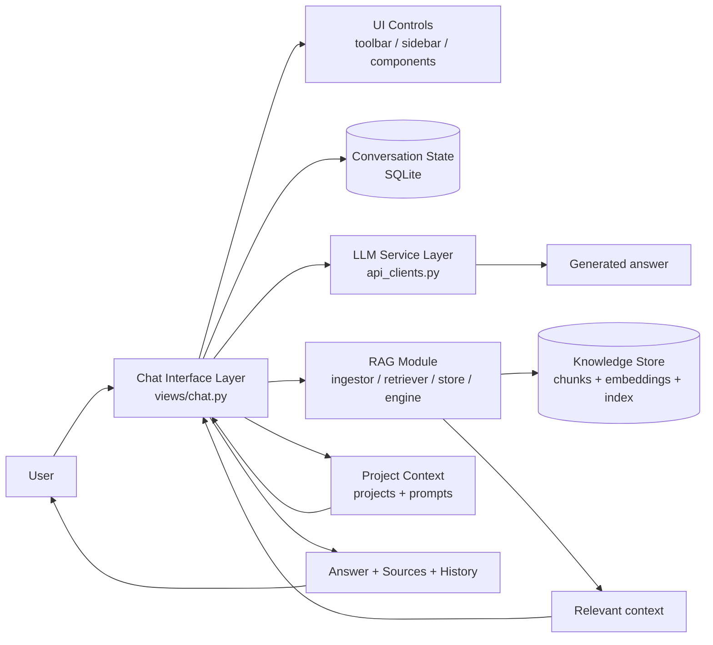

# Chat as interface layer

### Interpretation
- The Chat layer is the main interaction boundary.
- It orchestrates:
  - user input
  - project context
  - conversation history
  - optional RAG retrieval
  - LLM generation
- RAG is a backend capability used by chat, not the UI itself.
