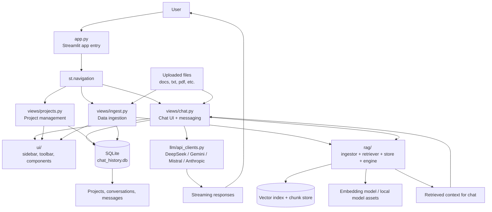

# General app diagram

```mermaid
flowchart TD
    U[User] --> A[app.py<br/>Streamlit app entry]
    A --> NAV[st.navigation]
    NAV --> C[views/chat.py<br/>Chat UI + messaging]
    NAV --> P[views/projects.py<br/>Project management]
    NAV --> I[views/ingest.py<br/>Data ingestion]

    C --> UI[ui/<br/>sidebar, toolbar, components]
    P --> UI
    I --> UI

    C --> DB[(SQLite<br/>chat_history.db)]
    P --> DB
    I --> DB

    C --> LLM[llm/api_clients.py<br/>DeepSeek / Gemini / Mistral / Anthropic]
    LLM --> RESP[Streaming responses]
    RESP --> U

    I --> RAG[rag/ <br/>ingestor + retriever + store + engine]
    C --> RAG
    RAG --> IDX[(Vector index + chunk store)]
    RAG --> MOD[Embedding model / local model assets]

    FILES[Uploaded files<br/>docs, txt, pdf, etc.] --> I
    FILES --> C

    DB --> PROJECTS[Projects, conversations, messages]
    RAG --> CONTEXT[Retrieved context for chat]
    CONTEXT --> C
```

This captures the app’s overall flow: the Streamlit app loads views, the UI talks to SQLite and the LLM layer, and the RAG pipeline enriches chat with document context.