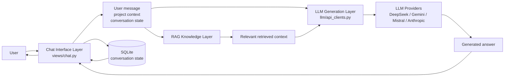

# LLM API as the generation layer

### Interpretation
- The chat layer orchestrates the request.
- The RAG layer provides grounding/context.
- The LLM API generates the actual response.
- SQLite stores the evolving conversation and project state.
