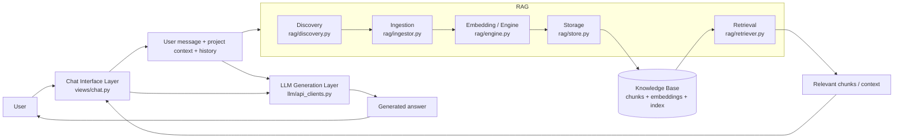

# RAG as the knowledge layer

### Meaning
- Chat is the interaction shell.
- RAG is the knowledge subsystem that turns files/data into searchable context.
- The LLM still does the reasoning and answer generation, but it can be grounded by retrieved knowledge.

This is the most accurate “layered” interpretation:
- Interface layer: chat
- Knowledge layer: RAG
- Generation layer: LLM
- Persistence layer: SQLite + indexed knowledge store
