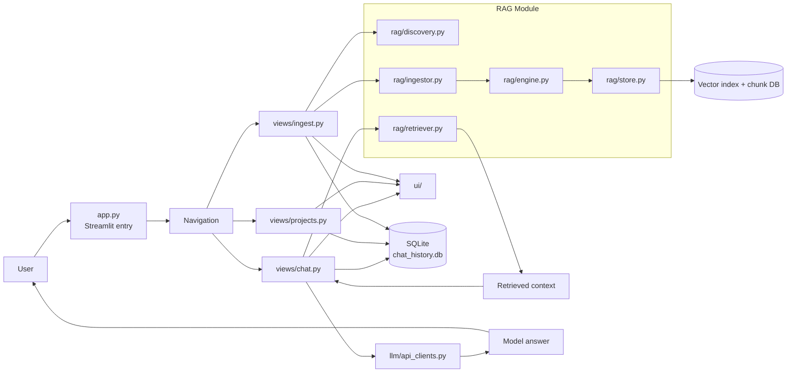

# RAG as a separate subsystem
RAG should be treated as a separate subsystem/module in the app, not just a checkbox in the chat UI. In this project, it has its own flow:

- ingestion
- storage
- embedding generation
- retrieval
- context injection into chat

A cleaner diagram is:

### In short
- Chat is the interface layer.
- RAG is the knowledge layer.
- SQLite is the conversation state.
- LLM API is the generation layer.

The diagram is much clearer when RAG is drawn as its own module, with its own input/output pipeline.