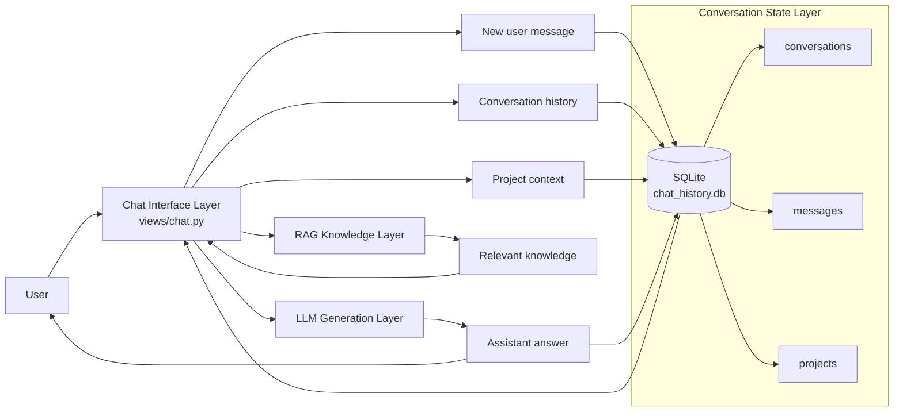

# SQLite as the conversation state

### What SQLite stores here
- conversations
- messages
- project metadata
- conversation state and history
- chat/session persistence

So conceptually:
- Chat = interface / orchestration
- RAG = knowledge retrieval
- SQLite = session/conversation memory
- LLM = generation engine
